# unraid-ugreen-idx6011-pro

Touch **LCD dashboard** + smart **front-panel LEDs** for the **UGREEN NASync iDX6011 Pro**
running **Unraid** — the full front panel, working natively, no UGOS required at runtime.

[](https://github.com/noodlemctwoodle/unraid-ugreen-idx6011-pro/releases/latest)
[](https://github.com/noodlemctwoodle/unraid-ugreen-idx6011-pro/actions/workflows/release.yml)
[](https://github.com/noodlemctwoodle/unraid-ugreen-idx6011-pro/releases)
[](https://unraid.net)
[](https://nas.ugreen.com)
[](#license)

> An independent project built by and for iDX6011 Pro owners — not made,
> affiliated with, or endorsed by UGREEN.

**Jump to:** [Features](#features) · [Requirements](#requirements) · [How it works](#how-it-works) ·
[Install](#installation) · [Dashboard](#the-dashboard) · [Customise](#customise-it) · [LEDs](#front-panel-leds) ·
[Configuration](#configuration) · [Upgrades](#after-an-unraid-os-upgrade) ·
[Troubleshooting](#troubleshooting) · [Building](#building-from-source) · [Credits](#credits)

## Features

- **Fully customisable touch dashboard** on the 258×960 front LCD. Build any page
  from a library of modules — CPU, memory, network, storage, GPU, NPU, power, fans,
  uptime, host, array status, OS/plugin updates, and per-item disk / interface /
  container / VM cards — each with a choice of visual styles: bar, ring, gauge,
  history graph, area, segmented blocks, used/free split, trend, or big number.
- **Web Layout editor** in the Unraid settings UI, with a **live preview** of the
  real panel: add / rename / reorder / delete pages, toggle them on or off, and pick
  each module's visualisation (and, for per-item cards, which disk/interface/etc.).
- **Theme it**: choose the dashboard font, heading and text sizes, and every palette
  colour (incl. card titles + dim text) with live colour pickers; point at any server
  image for the **wallpaper** and **header logo** (hot-swapped live); make cards
  translucent, hide the chrome for **full-screen image pages**, add spacer gaps, and
  save / load / share **theme presets**; pick network-rate units and the primary interface.
- **Fan control** from the panel: leave the fans to firmware (Auto), drive all four
  on **Silent / Quiet / Turbo** temperature curves (CPU fans by CPU temp, case fans by
  the hottest disk), or run them flat out (**Max**) — a floor keeps every fan spinning,
  with a forced 100% at critical temps. Live RPM on a Fans card, including an
  **animated spinning-fan** view.
- **Live stats**: CPU %/temp, memory, per-interface network rates + totals, per-disk
  temps/usage/health, GPU & NPU utilisation, **power draw** (Intel RAPL), array/parity
  state, docker containers (with IPs + image-update flags), VMs, and Unraid
  **notifications** badge + banner.
- **Smart front LEDs** (9× RGB): power, LAN link, and per-bay disk health — with
  configurable colours, on/off, and an **activity mode** that blinks on I/O.
- **Touch navigation**: swipe for pages, drag to scroll, tap the footer for next, tap
  to wake, long-press to dim — plus an on-panel Settings page for the common knobs.
- **Survives reboots and self-heals**: proper Unraid plugin (verified against the
  plugin-manager schema), re-asserts its boot chain at every start. Everything needed
  is in this repo — sources, the kernel wake-probe patch + overlay builder, and
  prebuilt binaries for disaster recovery.

## Requirements

- UGREEN NASync **iDX6011 Pro** (model-gated via DMI — the plugin no-ops elsewhere)
- **Unraid 7.3.x** on a USB flash labelled `UNRAID` (developed on 7.3.2 / kernel 6.18.38)
- **UGOS not required** — the plugin self-registers its own EFI boot entry, so a box
  with UGOS wiped from the NVMe works identically (see below)
- **BIOS Watchdog Timer disabled** — **mandatory** for any non-UGOS OS, or the box
  hard-resets every ~2 minutes. The setting is hidden by default: on the BIOS setup
  screen press **Ctrl+F1** to reveal the advanced menus, then find and disable the
  **Watchdog Timer**.

## How it works

Three discoveries make this possible (full story: [docs/SOLUTION.md](docs/SOLUTION.md)):

1. **The BIOS powers the front-panel rail only when it boots a *registered* EFI
   entry** — not the auto-generated removable-media fallback. So the plugin
   registers a named EFI entry (`Unraid (iDX6011 panel)`) for the USB flash with
   `efibootmgr` and keeps it first in the boot order. **No UGOS or NVMe required.**
   A wiped-UGOS box works identically — our registered entry is then the only one.
   This registered-vs-fallback insight builds directly on
   [Reevoy24/ugreen-idx6011-panel](https://github.com/Reevoy24/ugreen-idx6011-panel).
2. **Kernels ≥ 6.17 dropped the DPCD wake-probe** this panel's eDP bridge needs.
   Two one-line module patches (shipped as a small overlay initrd, `bzroot-wakefix` —
   the kernel image itself is untouched) restore it.
3. **The touchscreen (AXS15231B) needs no kernel driver**: the dashboard polls it
   directly over I²C with the chip's native command protocol.

```
BIOS (panel rail ON for a *registered* EFI entry)
 └─ "Unraid (iDX6011 panel)" EFI entry → USB flash → syslinux
     └─ /bzimage + /bzroot + /bzroot-wakefix
         └─ plugin at boot: re-asserts its EFI entry (assert-boot.sh)
                            → loads touch I²C stack
                            → starts panel_dash (dashboard) + LED monitor
```

## Installation

> [!NOTE]
> **Self-contained**: the plugin downloads a SHA256-verified payload from the GitHub
> release and stages everything itself (scripts, binaries, touch modules, display
> overlay, icon). The from-source / manual runbook — and how to rebuild for a
> different kernel — is **[docs/front-panel-blueprint.md](docs/front-panel-blueprint.md)**.

1. **Plugins → Install Plugin** in the Unraid UI, paste this URL, install:
   ```
   https://raw.githubusercontent.com/noodlemctwoodle/unraid-ugreen-idx6011-pro/main/ugreen-idx6011-pro.plg
   ```
   It downloads its payload, stages everything, and registers its EFI boot entry
   (`assert-boot.sh`).
2. **Reboot.** The firmware boots the registered `Unraid (iDX6011 panel)` entry (the
   BIOS powers the panel rail only for a registered entry) — the panel lights, the
   dashboard starts, and the LEDs go live.

⚠️ **Disable the BIOS Watchdog Timer first** (see [Requirements](#requirements)) —
otherwise the box hard-resets every ~2 minutes on any non-UGOS OS.

## The Dashboard

<table align="center">
  <tr>
    <td align="center" valign="top">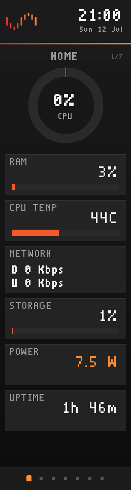<br><sub><b>Home</b></sub></td>
    <td align="center" valign="top">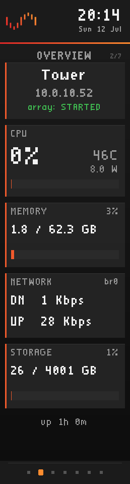<br><sub><b>Overview</b></sub></td>
    <td align="center" valign="top">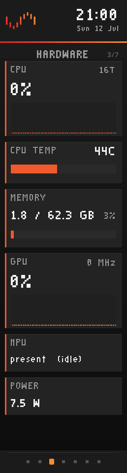<br><sub><b>Hardware</b></sub></td>
    <td align="center" valign="top">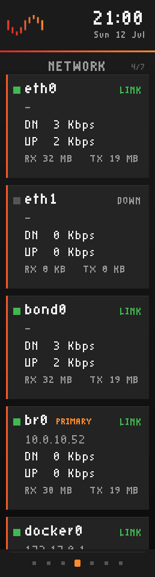<br><sub><b>Network</b></sub></td>
  </tr>
  <tr>
    <td align="center" valign="top">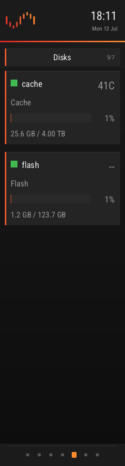<br><sub><b>Disks</b></sub></td>
    <td align="center" valign="top">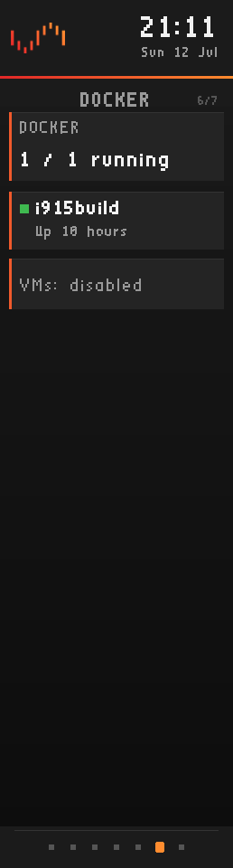<br><sub><b>Docker</b></sub></td>
    <td align="center" valign="top">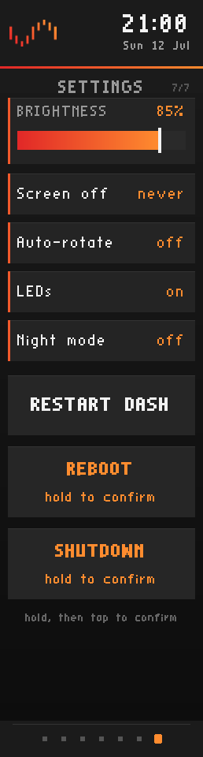<br><sub><b>Settings</b></sub></td>
    <td align="center" valign="top"></td>
  </tr>
</table>

<p align="center"><sub>Live 258×960 front panel, rendered on-device — the <b>default</b> pages (every one is fully editable).</sub></p>

The pages above are just a starting point. **Every page is built from modules you
choose in the web Layout editor**, each with its own visual style — so no two panels
have to look alike:

<table align="center">
  <tr>
    <td align="center" valign="top">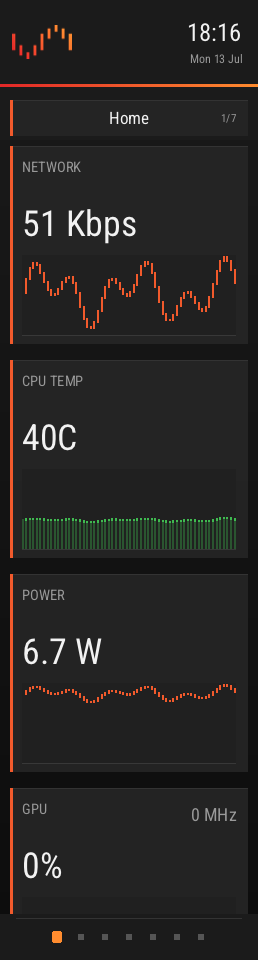<br><sub><b>History graphs</b></sub></td>
    <td align="center" valign="top">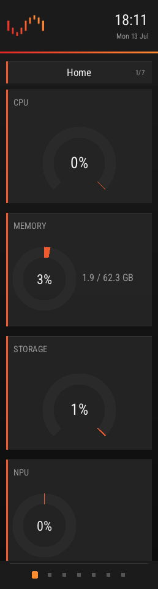<br><sub><b>Rings &amp; gauges</b></sub></td>
    <td align="center" valign="top">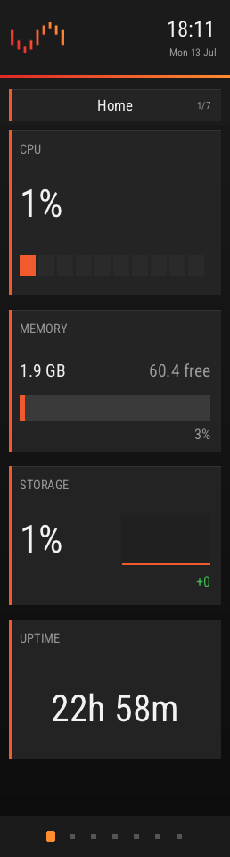<br><sub><b>Blocks / split / trend</b></sub></td>
    <td align="center" valign="top">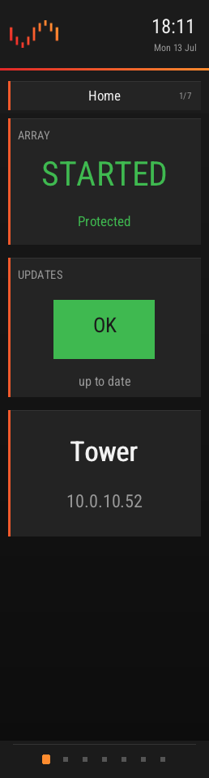<br><sub><b>Status cards</b></sub></td>
  </tr>
  <tr>
    <td align="center" valign="top">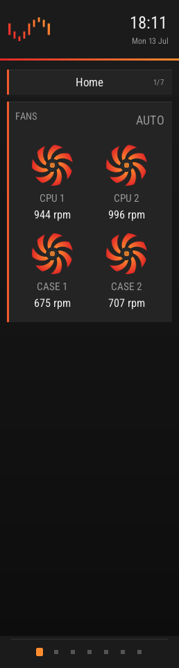<br><sub><b>Fan dials</b></sub></td>
    <td align="center" valign="top">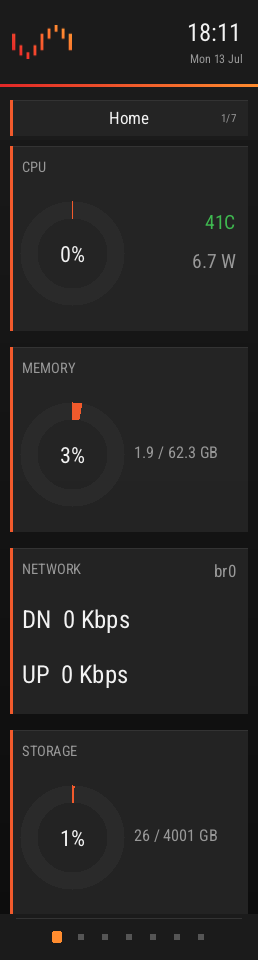<br><sub><b>Theme: default</b></sub></td>
    <td align="center" valign="top">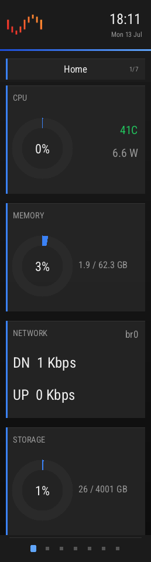<br><sub><b>Theme: blue</b></sub></td>
    <td align="center" valign="top">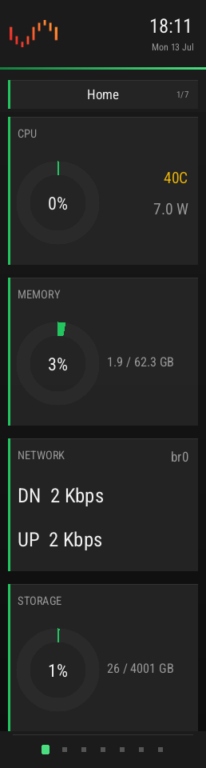<br><sub><b>Theme: green</b></sub></td>
  </tr>
</table>

<p align="center"><sub>A few of the module styles + palettes — mix and match your own in the Layout editor.</sub></p>

| Default page | Contents |
|------|----------|
| **HOME** | CPU + memory + storage ring gauges, primary network rates, power, uptime |
| **OVERVIEW** | hostname/IP, array + parity state, CPU %+temp+watts, RAM, net rates, storage |
| **HARDWARE** | CPU sparkline + temp, **fan dials**, memory, GPU %+MHz sparkline, NPU, power |
| **NETWORK** | one card per interface: rates, IPv4/IPv6, RX/TX totals since boot |
| **DISKS** | one card per disk: health dot, temp / SLEEP, errors, usage bar, capacity |
| **DOCKER** | running/total count + one card per container (status, IP, update flag) + VMs |
| **SETTINGS** | **touch controls**: brightness slider, screen-off timer, auto-rotate, LED toggle, night mode, **fan mode**, restart, reboot/shutdown (hold-to-confirm) |

| Gesture | Action |
|---------|--------|
| Swipe left / right | next / previous page |
| Drag up / down | scroll within the page (1:1) |
| Tap footer dots | next page |
| Tap | wake backlight |
| Long-press | dim toggle |

## Customise it

Everything is configured from **Settings → UGREEN iDX6011 Pro** in the Unraid web UI
(three tabs: **Screen**, **Lighting**, **Display**), and most of it live-previews on a
render of the real panel:

- **Display ▸ Layout** — the visual page builder. Add / rename / reorder / delete pages,
  toggle each on or off, add modules (including **Spacer** gaps to push content down), and
  pick each module's **style** (and, for the per-item cards, **which** disk / interface /
  container / VM). Per page you can hide the **header bar / title card / page dots** — all
  off + a wallpaper gives a **full-screen image page** — and set a **card-opacity** override.
  A live preview sits beside you.
- **Display ▸ Theme** — the dashboard **font**, **heading / text sizes**, the full
  **colour palette** (accent, gradient, background, card, text, ok / warn / bad) via colour
  pickers, and a global **card-opacity** slider. Point the panel at any image on the server
  — a **file browser** — for the **wallpaper** and a **custom header logo**; both hot-swap on
  the panel **live, with no restart**.
- **Screen** — brightness, stats refresh, auto-rotate, screen-off timer, night mode,
  **fan mode**, network-rate units (bits / bytes) and the primary network interface.
- **Lighting** — the front-LED master + power light, **activity mode**, and the LAN /
  per-disk-state **LED colours**.

The common knobs (brightness, rotate, LEDs, night mode, fan mode…) are also editable
live from the panel's own touch **SETTINGS** page.

## Wallpapers & themes

Point the panel at **any image on the server** (Display ▸ Theme ▸ **Browse**) — it hot-swaps
**live, no restart**. Make cards **translucent** (globally or per page) so the picture shows
through, add **Spacer** modules to open up space, and hide any page's **header / title / page
dots** for a clean **full-screen image**. Text keeps a subtle shadow over a wallpaper so it
stays legible.

<table>
  <tr>
    <td align="center" valign="top">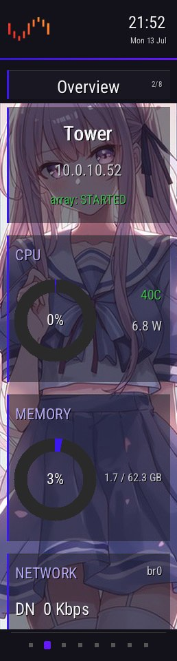<br><sub><b>Translucent cards</b></sub></td>
    <td align="center" valign="top"><br><sub><b>Full-screen page</b></sub></td>
    <td align="center" valign="top">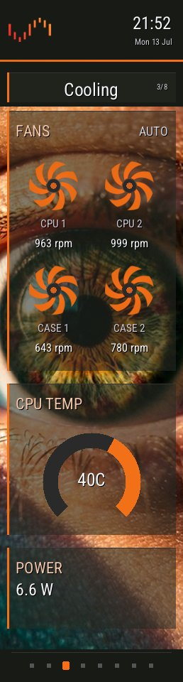<br><sub><b>Animated fans</b></sub></td>
    <td align="center" valign="top">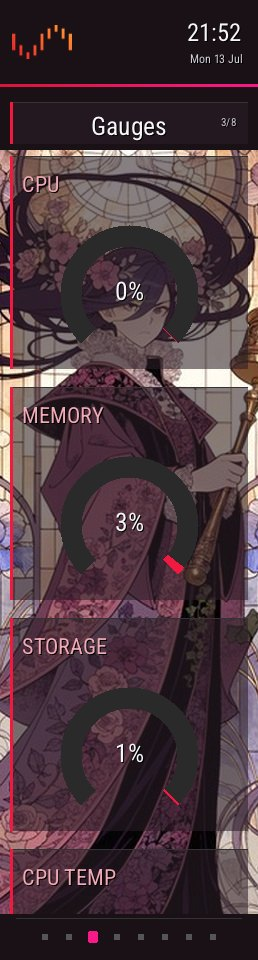<br><sub><b>Gauges</b></sub></td>
  </tr>
  <tr>
    <td align="center" valign="top">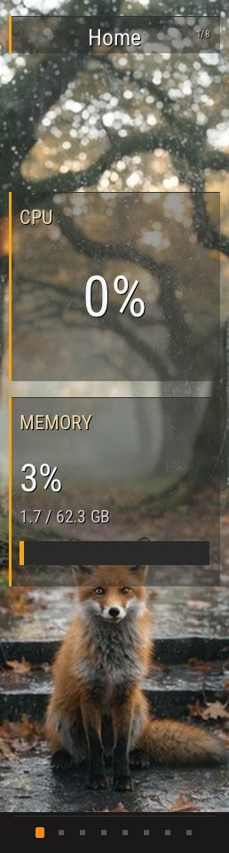<br><sub><b>Spacer + big value</b></sub></td>
    <td align="center" valign="top">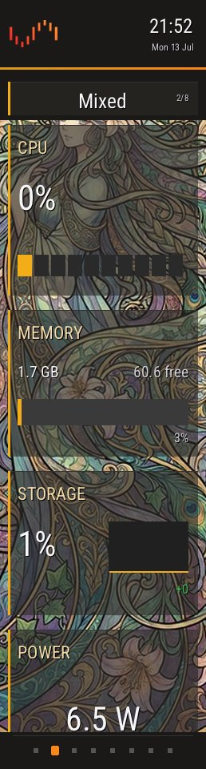<br><sub><b>Blocks / split / trend</b></sub></td>
    <td align="center" valign="top">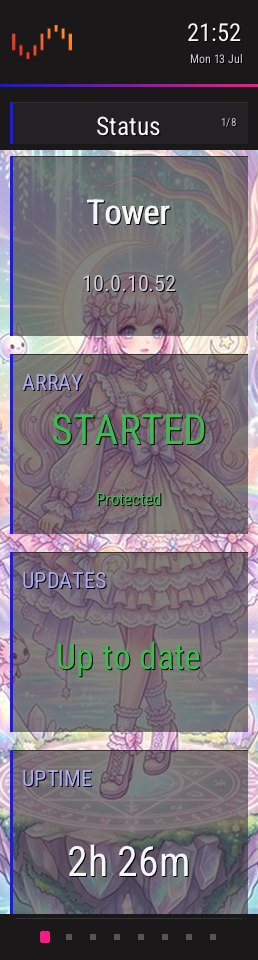<br><sub><b>Status cards</b></sub></td>
    <td align="center" valign="top"><br><sub><b>Full-bleed</b></sub></td>
  </tr>
</table>

The **card-opacity** slider (global, or a per-page override) blends the cards into the image:

<table>
  <tr>
    <td align="center" valign="top">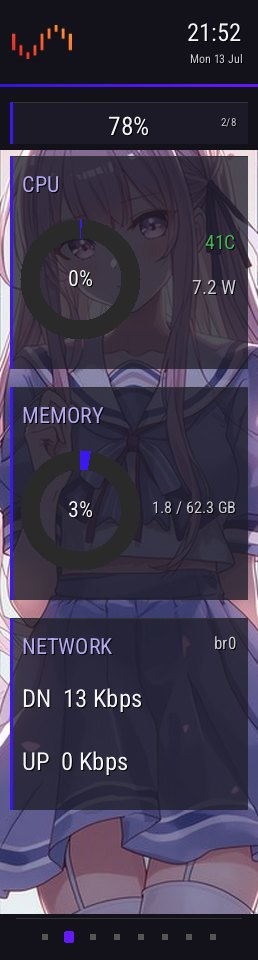<br><sub>78%</sub></td>
    <td align="center" valign="top">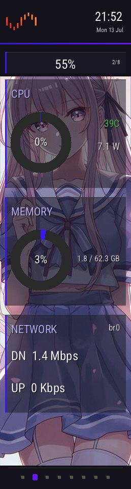<br><sub>55%</sub></td>
    <td align="center" valign="top">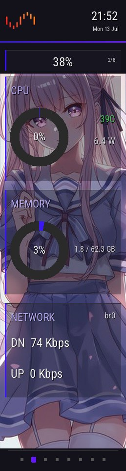<br><sub>38%</sub></td>
  </tr>
</table>

### Theme presets & sharing

The **Theme** tab has built-in **presets** — Unraid, Sakura, Ember, Abyss, Aurora, Grape,
Cyber, Mono — that recolour the whole dashboard in a click. **Save current…** writes your
theme to a file:

```
/boot/config/plugins/ugreen-idx6011-pro/panel/themes/<name>.cfg
```

That folder is on the flash **`config`** share
(`\\TOWER\flash\config\plugins\ugreen-idx6011-pro\panel\themes\`), so **sharing a theme is
just copying its `.cfg`** — drop one in and it shows up in the **Load a theme…** dropdown. A
theme is only the palette, font, sizes and card opacity; nothing device-specific.

### Example wallpapers

A set of **258×960 wallpapers** (cropped to the panel) lives in
[`images/wallpapers/`](images/wallpapers) — drop them on a share and Browse to them. They are
**not** shipped in the plugin.

<table>
  <tr>
    <td></td>
    <td></td>
    <td></td>
    <td></td>
    <td></td>
    <td></td>
    <td></td>
  </tr>
  <tr>
    <td>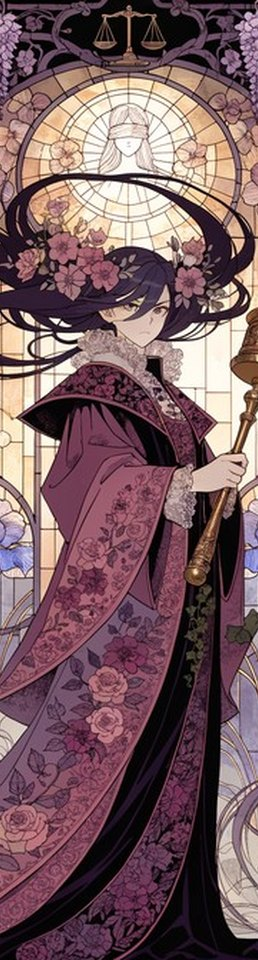</td>
    <td></td>
    <td></td>
    <td></td>
    <td></td>
    <td></td>
    <td>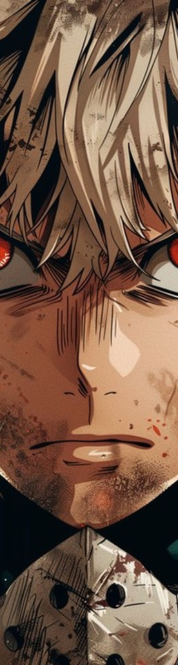</td>
  </tr>
</table>

<sub>Example wallpapers via <a href="https://stockcake.com">StockCake</a> (free for personal &amp; commercial use).</sub>

## Front-panel LEDs

Colours and behaviour are configurable on the **Lighting** tab; the defaults:

| LED | Behaviour |
|-----|-----------|
| Power | solid **white** |
| LAN1 / LAN2 | **blue** when link up, off when down |
| Disk bay (empty) | off |
| Disk bay (healthy) | **green** |
| Disk bay (pending/reallocated sectors) | **amber** |
| Disk bay (SMART fail / not responding) | **red** |

<details>
<summary>Why a special CLI build is required on this model</summary>

The iDX6011 Pro uses a **different LED protocol** (SMBus block-write) than older
DX/DXP models — the stock `ugreenleds-driver` kernel module and the upstream
`ugreen_leds_cli` predate this box and cannot drive its disk/netdev LEDs.
This plugin uses **[klein0r's fork](https://github.com/klein0r/ugreen_leds_controller)**
(iDX6011 protocol; LED names `power / network_stat / network_stat2 / disk1-6`).
The **power LED** can't be set by the CLI at all on this model (its init probe zeroes
the power register), so it's driven by a raw i2c sequence, re-asserted after every
CLI write. The SMBus bus number is auto-detected by adapter name (`SMBus I801`) —
it shifts when other I²C drivers load.
</details>

**Bay mapping**: the correct port→bay map ships built in. To verify or fix it, run the
one-time wizard — it lights each bay and asks which disk is in it, then writes
`mapping.conf` (picked up live, no restart):

```bash
bash /boot/config/plugins/ugreen-idx6011-pro/calibrate.sh
```

## Configuration

Almost everything is set from the web UI (see [Customise it](#customise-it)); the
underlying store is `/boot/config/plugins/ugreen-idx6011-pro/panel/settings.cfg`
(user edits survive updates). The core keys:

| Key | Default | Meaning |
|-----|---------|---------|
| `BRIGHTNESS` | `75` | backlight percent (5–100) — driven via the EC |
| `INTERVAL` | `1` | stats refresh seconds |
| `ROTATE` | `0` | auto-rotate pages every N seconds; `0` = off |
| `SCREEN_OFF_MIN` | `0` | blank the panel after N idle minutes; `0` = never |
| `NIGHT` | `0` | night mode: clamp brightness to 15% |
| `LEDS` | `1` | front LEDs on/off |
| `FAN_MODE` | `auto` | fans: `auto` (firmware), `silent` / `quiet` / `turbo` (temperature curves), or `max` (100%). Curves keep every fan ≥25% and force 100% at critical temps |
| `NET_UNITS` | `bits` | network-rate units: `bits` (Kbps/Mbps, matches Unraid) or `bytes` (KB/s) |
| `PRIMARY_IFACE` | *(auto)* | interface whose rates the Overview/Home pages show; empty = auto-pick the default-route interface. Set e.g. `bond0` to match the Unraid dashboard. Falls back to auto-pick if the named interface is absent. |

Theme (`FONT`, `HEAD_SCALE`, `TEXT_SCALE`, `CARD_OPACITY`, and the `COL_*` palette
incl. `COL_TITLE` / `COL_DIM`), the wallpaper/logo paths (`WALLPAPER`, `LOGO`), the LED
colours (`LED_*`) and the page layout (`N_PAGES`, `PAGE<n>_NAME|LAYOUT|ON|HEADER|TITLE|
DOTS|CARDOP`) are also stored here but are best edited from the web UI. Saved themes are
separate files in `…/panel/themes/*.cfg`. The common knobs are editable live from the
panel's own **SETTINGS** page too.

- **Wallpaper / header logo**: point at any image on the server from **Display ▸ Theme**
  (a file browser) — stored as `WALLPAPER=` / `LOGO=` and hot-swapped on the panel **live,
  no restart**. Any size, auto-scaled. A legacy `panel/wallpaper.png` / `logo.png` is still
  honoured for back-compat.
- Dashboard CLI flags (for manual runs): `--bg ` `--backlight <pct>`
  `--interval <s>` `--rotate <s>` `--touch </dev/i2c-N>` `--no-touch`
  `--cal <s|x|y>` `--once` `--shot <dir>` `--preview <page> <layout> <out>`;
  `TOUCH_DEBUG=1` traces touch frames.

## After an Unraid OS upgrade

> [!NOTE]
> A new Unraid release means a new kernel, and the display-module overlay is
> kernel-bound. The panel stays dark (with an Unraid notification; nothing breaks)
> until you rebuild — one command, then reboot:
>
> ```bash
> bash plugin/boot/build-overlay.sh plugin/boot/i915-edp-wakeprobe-<kver>.patch
> ```

## Troubleshooting

| Symptom | Cause → fix |
|---------|-------------|
| Boots the wrong OS / not Unraid | Reinsert the USB flash, then in the BIOS put the panel entry first: **Boot → UEFI USB Hard Disk Drive BBS Priorities → `Unraid (iDX6011 panel)`** |
| Panel dark, dmesg shows `PP_STATUS: 0x00000000` | Booted via the removable-media fallback, not the registered entry. The OS-set BootOrder (`efibootmgr -o`) may not override the per-class USB priority on this firmware — set it in the BIOS: **Boot → UEFI USB Hard Disk Drive BBS Priorities → `Unraid (iDX6011 panel)`** |
| Panel dark after an Unraid upgrade | Kernel changed → rebuild the overlay (above) |
| Dashboard frozen but process running | i915 framebuffer compression serving a stale frame → update to a build with per-frame `DirtyFB` (any current one) |
| Touch dead | `ls /sys/bus/i2c/devices/` should list `i2c-CUST0000:00` — if not, the LPSS module chain didn't load; re-run the plugin install |
| LEDs dark or partially working | Wrong CLI variant — must be the klein0r iDX6011 build ([prebuilt/](prebuilt/)) |
| Box hard-resets every ~2 min | BIOS watchdog enabled → disable it |

More: [docs/SOLUTION.md section 8](docs/SOLUTION.md) (recovery procedures table).

## Building from source

Everything builds in a Debian container on the box (the plugin's own docs assume
`i915build` with `/mnt/cache/build` mounted at `/build`):

- **Dashboard**: `src/panel/` (modular C99; `panel_dash.c` aggregates the modules + vendored stb headers) → [src/panel/build.sh](src/panel/build.sh)
- **Display-module overlay + touch-stack modules**: [boot/build-overlay.sh](boot/build-overlay.sh)
  (applies [boot/i915-edp-wakeprobe-6.18.38.patch](boot/i915-edp-wakeprobe-6.18.38.patch),
  builds against Unraid's own kernel config, packs the overlay with the required
  `xz --check=crc32` compression)
- **LED CLI**: `make` in klein0r's `cli/` dir (needs `g++`, `libi2c-dev`)
- **i2c-tools**: static build from kernel.org source, packed as an
  `installpkg`-able txz (not available in Slackware repos)

## Repository layout

```
ugreen-idx6011-pro.plg   Unraid plugin manifest (schema-verified, lifecycle-tested)
src/                     shell scripts (LED + LCD + boot heal); src/panel/ = modular dashboard C
boot/                    kernel wake-probe patch + overlay build script
prebuilt/                verified binaries: panel_dash, bzroot-wakefix (kernel-bound),
                         ugreen_leds_cli (klein0r/iDX6011), i2c-tools txz
images/                  plugin icon, README screenshots + example wallpapers (icon only is bundled)
docs/SOLUTION.md         architecture + every hardware discovery, with evidence
docs/front-panel-blueprint.md   numbered install runbook + hardware reference appendix
docs/PLUGIN.md           Unraid plugin-schema conformance + release process
```

## Known limitations

- The display-module overlay is **kernel-bound** — after an Unraid OS upgrade the
  panel stays dark (with a notification, nothing breaks) until you rebuild it — one
  command, then reboot (see [above](#after-an-unraid-os-upgrade)).
- **Fan control** is active only while `panel_dash` runs: a clean stop hands the fans
  straight back to firmware auto, but an uncatchable kill leaves them at their last
  (still-spinning, ≥25%) speed until the process restarts.
- The Docker **image-update** flag is best-effort — read from Unraid's docker
  update-status file, so it only appears for Community-Applications-managed containers.

## Credits

Built on the work of others — this would not exist without:

- [Reevoy24/ugreen-idx6011-panel](https://github.com/Reevoy24/ugreen-idx6011-panel) —
  the **registered-EFI-entry boot method** this whole plugin rests on (it's why the panel
  lights with no UGOS/NVMe), plus EC fan/backlight register documentation. A kindred
  multi-platform (Proxmox/TrueNAS) panel project.
- [klein0r/ugreen_leds_controller](https://github.com/klein0r/ugreen_leds_controller) and
  [miskcoo/ugreen_leds_controller](https://github.com/miskcoo/ugreen_leds_controller) —
  LED protocol + CLI; the bundled `ugreen_leds_cli` is klein0r's iDX6011 fork (GPL-2.0)
- [ich777/unraid-ugreenleds-driver](https://github.com/ich777/unraid-ugreenleds-driver) —
  original Unraid LED packaging approach
- [Incipiens/ugreen-idx6011-pro-nas-display](https://github.com/Incipiens/ugreen-idx6011-pro-nas-display) —
  early panel reverse-engineering groundwork
- The [Linux kernel](https://www.kernel.org) (Intel i915 / DRM DisplayPort + Intel LPSS /
  DesignWare I²C drivers) — the shipped `bzroot-wakefix` display overlay and the touch-stack
  modules are compiled, patched builds of these **GPL-2.0** sources; the exact source diff
  is in [boot/i915-edp-wakeprobe-6.18.38.patch](boot/i915-edp-wakeprobe-6.18.38.patch)
- [i2c-tools](https://git.kernel.org/pub/scm/utils/i2c-tools/i2c-tools.git) (kernel.org /
  lm-sensors) — bundled static `i2cset/i2cget/i2ctransfer` for the raw power-LED I²C
  sequence the CLI can't drive (GPL-2.0)
- [nothings/stb](https://github.com/nothings/stb) — `stb_easy_font`, `stb_image` and
  `stb_image_write` (public domain / MIT)
- [homarr-labs/dashboard-icons](https://github.com/homarr-labs/dashboard-icons) — the
  official Unraid header mark embedded in the dashboard (Apache-2.0 icon set)
- **Deivizzz** — the plugin icon: original line-art of the iDX6011 Pro, used in the
  Unraid plugin manager and the Community Applications listing
- [StockCake](https://stockcake.com) — the example wallpapers in `images/wallpapers/`
  (free for personal &amp; commercial use); not bundled in the plugin
- [libdrm](https://gitlab.freedesktop.org/mesa/drm) — DRM dumb-buffer rendering the
  dashboard links against at runtime (MIT)

Related upstream work: the eDP DPCD wake fix *"drm/i915/dp: On DPCD init wake the DPRx for
eDP"* (Arun R Murthy) addresses the same kernel regression — see
[docs/SOLUTION.md](docs/SOLUTION.md).

## License

This project's own scripts and dashboard source are **MIT** — see [LICENSE](LICENSE).

Bundled/derived components keep their upstream licenses (**GPL-2.0** for
`ugreen_leds_cli`, the kernel-derived `bzroot-wakefix` overlay + touch modules, and
`i2c-tools`; public domain / MIT for the stb headers; Apache-2.0 for the embedded
Unraid icon), and the Unraid / UGREEN names and marks belong to their owners. Full
details in [THIRD-PARTY-NOTICES.md](THIRD-PARTY-NOTICES.md).
